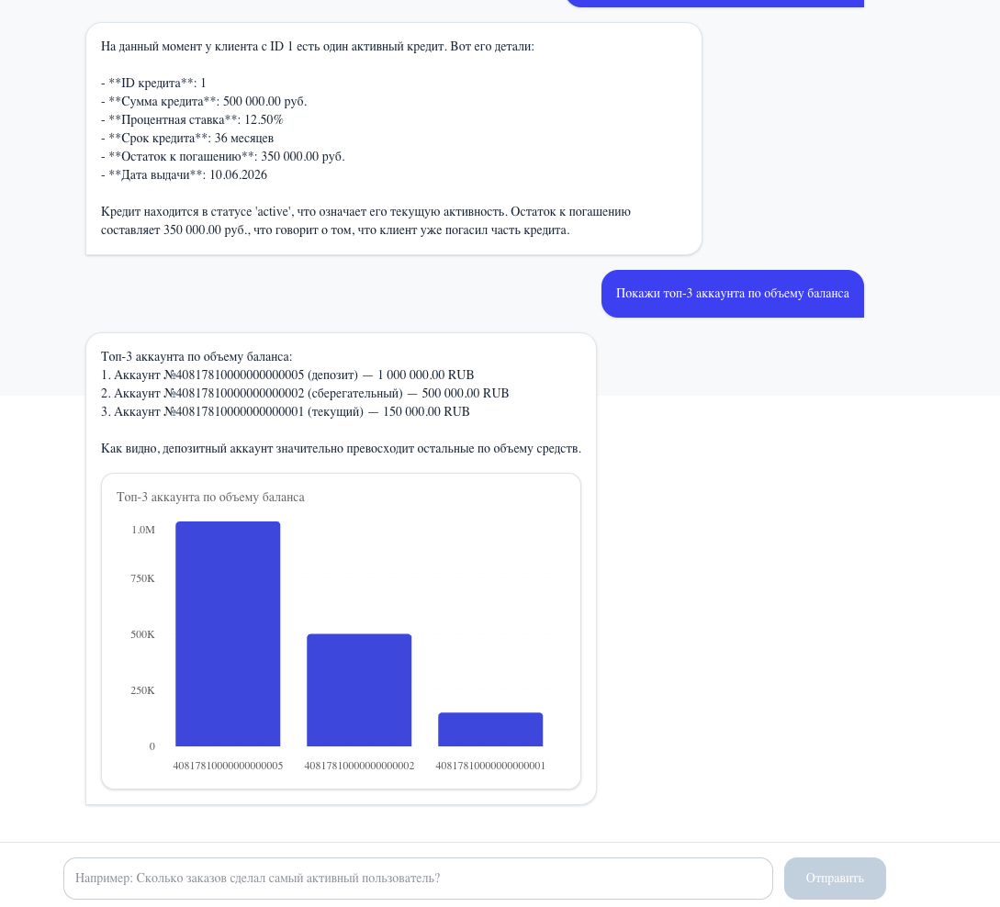

# Autonomous AI SQL Analyst (Multi-Agent RAG + Text-to-SQL)

Промышленный ИИ-агент на базе **LangGraph** и векторной базы знаний **Qdrant**, построенный по многоагентной архитектуре (**Multi-Agent Supervisor Pattern**). Система автономно переводит текстовые вопросы пользователя на естественном языке в точные аналитические SQL-запросы, выполняет их в реляционной СУБД **PostgreSQL** и возвращает структурированный человекочитаемый ответ.

---

## 🗺 Архитектура мультиагентного графа (Edgeless Command Pattern)

Управление потоком данных осуществляется детерминированным роутером-диспетчером, который изолирует контекст каждого агента и координирует шаги с помощью нативных команд перенаправления (`Command`), исключая появление циклов и замусоривание истории сообщений.

```text
               ┌─────────────── START ───────────────┐
               │                                     ▼
               │                            ┌────────────────┐
               │                            │ Гибридный      │◄────────────────┐
               │                            │ РОУТЕР         │                 │
               │                            └───────┬────────┘                 │
               │                                    │                       │
               │                      Какое решение принял Роутер?          │
               │                                    │                       │
               ├────────────────────────┬───────────┴───────────┬───────────┤
               │                        │                       │           │
       Контекст пуст?            Нужны данные?            Данные в буфере?  │
               │                        │                       │           │
               ▼                        ▼                       ▼           │
     ┌──────────────────┐     ┌──────────────────┐    ┌──────────────────┐  │
     │ АГЕНТ QDRANT     │     │ АГЕНТ-ПРОГРАММИСТ│    │ АГЕНТ-КОПИРАЙТЕР │  │
     │ (Библиотекарь)   │     │ (SQL-разработчик)│    │ (Синтез речи)    │  │
     └─────────┬────────┘     └─────────┬────────┘    └─────────┬────────┘  │
               │                        │                       │           │
        Ищет схемы таблиц        Пишет SQL-код                  │           │
        в векторной базе         и выполняет его                │           │
        знаний через RAG         в PostgreSQL                   │           │
               │                        │                       │           │
        Записывает DDL           Записывает сырой               │           │
        в state["context"]       лог в state["sql_result"]      │           │
               │                        │                       │           │
               └────────────────────────┴───────────────────────┼───────────┘
                                                                ▼
                                                       Формирует ответ юзеру
                                                       и сбрасывает кэш
                                                                │
                                                                ▼
                                                               END
```

---

## 🚀 Ключевые особенности архитектуры

1. **Разделение ответственности (Separation of Concerns):** Система разбита на узкоспециализированных агентов со своими изолированными системными промптами. Программист не умеет вежливо общаться, а Копирайтер не знает структуры таблиц. Это гарантирует максимальную точность генерации SQL.
2. **Локальный скрытый Self-Correction Loop:** Агент-Программист обладает правом на ошибку. Если СУБД PostgreSQL возвращает синтаксическую ошибку, узел локально перезапускает генерацию (до 3 попыток), анализирует лог ошибки и исправляет код, не перегружая глобальную историю переписки техническим мусором.
3. **Изолированный буфер данных (`sql_result`):** Сырые строки и колонки, возвращенные базой данных, передаются между Программистом и Копирайтером через временный буфер. В конце шага буфер очищается, благодаря чему контекстное окно LLM не раздувается, экономя токены и деньги на OpenRouter.
4. **Контекстная память (Checkpointing):** Встроенный чекпоинтер `MemorySaver` сохраняет историю диалога в рамках `thread_id`. Агент способен удерживать контекст беседы и отвечать на лаконичные уточняющие вопросы (например, *«А сколько заказов сделал первый пользователь из этого списка?»*), самостоятельно вычисляя связи на основе прошлых реплик.
5. **Мульти-арендность баз данных (Multi-DB via Threads):** Переключение между различными базами данных и наборами таблиц происходит на лету в рантайме. Достаточно передать уникальный `thread_id` для сессии, и агент автоматически изолирует контекст, работая со строго определенной структурой СУБД.
6. **Контекстный ИИ-генератор графиков:** Агент анализирует структуру ответа из БД. Если данные содержат сравнительные метрики, списки или динамику, система автоматически генерирует структурированную JSON-схему данных для интерактивной визуализации, разделяя текстовый ответ и метаданные.

---

## 🛠 Технологический стек

* **Оркестрация и Графы:** LangGraph (Message Reducers, Command-based Routing) [text].
* **Векторный RAG-индекс:** Qdrant (Docker) [text].
* **Гибридный поиск:** FastEmbed (Локальные эмбеддинги: плотные векторы `MiniLM` + разреженные векторы `SPLADE` для точного полнотекстового совпадения ключевых слов) [text].
* **Реляционная СУБД:** PostgreSQL 16 (Docker-контейнер с изоляцией томов и SELinux флагами прав доступа) [text].
* **Языковые модели:** Интеграция любых LLM (OpenAI, DeepSeek, Anthropic) через OpenRouter API и нативный пакет `langchain-openrouter` с поддержкой стабильного режима **Structured Outputs** [text].
* **Менеджер пакетов и Окружение:** `uv` (сверхбыстрый менеджер зависимостей с полной поддержкой строгой статической типизации Pylance/mypy) [text].
* **Наблюдаемость и Трейсинг:** **Langfuse** (полный аудит шагов графа, трекинг задержек, стоимости токенов, логирования ошибок и промпт-менеджмента).

---


## 💻 Визуальный интерфейс (UI/UX)


*Интерактивное окно чата с автоматическим рендерингом бизнес-графиков по текстовому запросу.*

* **Современный стек:** Интерфейс разработан на **Next.js (App Router)** с полной типизацией на TypeScript.
* **Интерактивная визуализация:** Для вывода графиков используется связка **Shadcn UI Charts + Recharts**, глубоко интегрированная с утилитами стилей **Tailwind CSS v4**.
* **Контекстный рендеринг:** Компоненты графиков (Bar, Line, Pie) жестко привязаны к конкретным сообщениям в истории чата (`messages`), что позволяет сохранять хронологию и предотвращает перезапись старых графиков новыми ответами.

---

## 📦 Быстрый старт (Развертывание одной кнопкой)

### 1. Клонирование окружения
Для запуска всей экосистемы (Фронтенд, Бэкенд с ИИ-графом, PostgreSQL и векторная база Qdrant) вам понадобятся только установленные **Docker** и **Docker Compose**. Локальная установка Python и Node.js не требуется. 

Склонируйте репозиторий и настройте изолированное виртуальное окружение:

```bash
# Клонируем репозиторий проекта
git clone https://github.com/Nikita451/my-text-to-sql.git
cd my-text-to-sql

# Заполните обязательные переменные
cp .env.example .env
```

### 2. Запуск проекта через Docker
Для гарантированно чистого и автоматического развертывания всей инфраструктуры (FastAPI, Next.js, PostgreSQL, Qdrant, Langfuse) выполните следующие шаги:

1. Убедитесь, что у вас установлен **Docker** и запущен **Docker Desktop**.
2. Скопируйте шаблон окружения и заполните ваши API-ключи (в первую очередь `OPENROUTER_API_KEY`):
   ```bash
   cp .env.example .env
   ```
3. **Очистка локального кэша (Обязательно)**: 
   Перед сборкой контейнеров удалите остатки локального запуска, чтобы избежать конфликтов операционных систем внутри Docker:
   ```bash
   # Удаление кэша сборки фронтенда
   rm -rf ui/.next

   # Рекурсивное удаление кэша компиляции Python
   find . -type d -name "__pycache__" -exec rm -r {} +
   ```
4. Запустите сборку новых образов и старт всех контейнеров в фоновом режиме:
   ```bash
   docker compose build --no-cache
   docker compose up -d
   ```
5. Дождитесь инициализации (первый запуск может занять 2-3 минуты, так как Docker автоматически установит зависимости и скачает необходимые ИИ-модели эмбеддингов во внутренние тома). Проверить статус запуска можно командой:
   ```bash
   docker compose logs -f agent ui
   ```
6. После успешного запуска проект будет доступен по адресам:
   * **Интерфейс ИИ-агента (UI)**: `http://localhost:3001`
   * **Документация FastAPI (Swagger)**: `http://localhost:8000/docs`
   * **Аналитика Langfuse**: `http://localhost:3000`
   * **Управление БД Adminer**: `http://localhost:8080`

Чтобы полностью остановить проект и очистить контейнеры, выполните:
```bash
docker compose down
```

### 3. Инициализация и наполнение баз данных
Для работы агента необходимо создать workspace через UI на главном странице.
Для этого заполнить соответствующую форму: имя, описание, sql-скрипт с предметной областью
и файл json с few-shot-примерами и бизнес-правилами предметной области. 
Примеры файлов для загрузки, а также вопросы для агента можно найти в директории
/init_data/simple_example и /init_data/bank_example.

