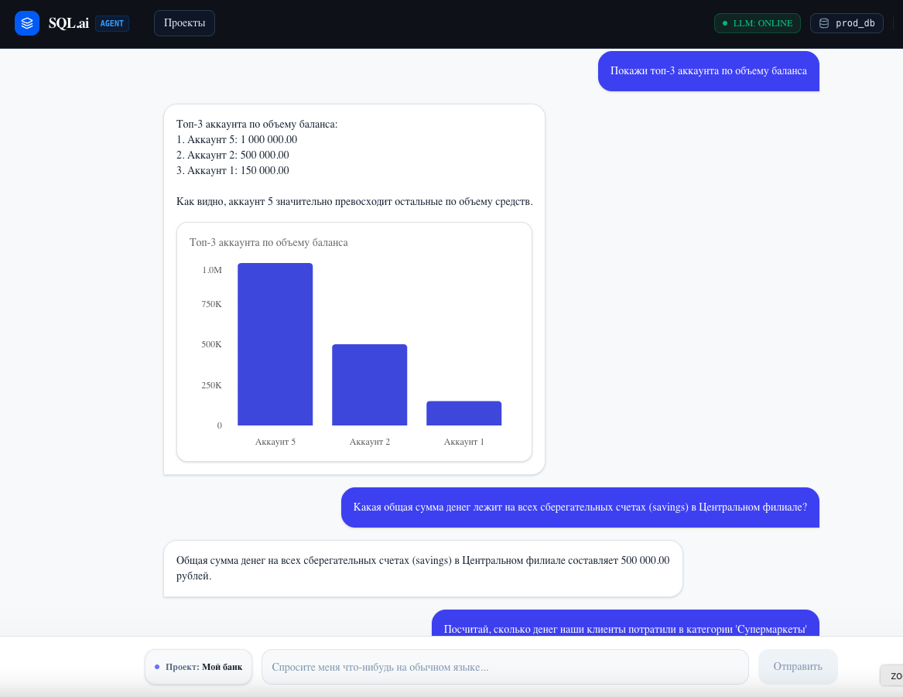
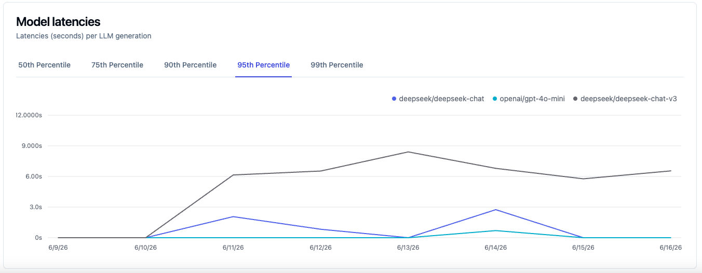
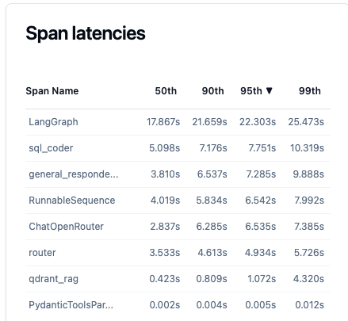
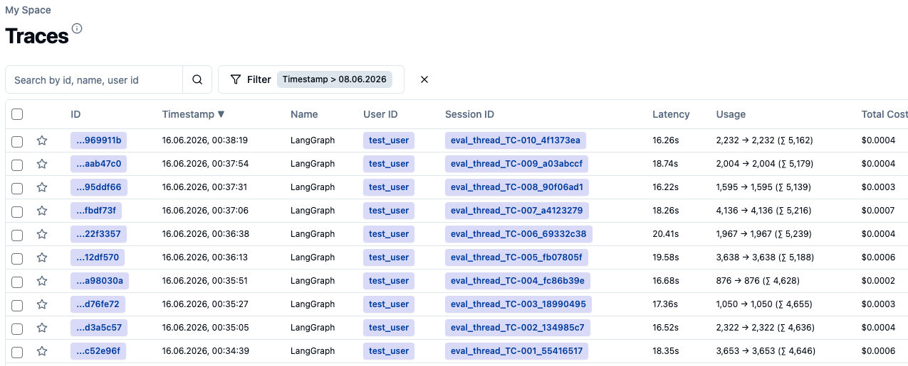

# Autonomous AI SQL Analyst (Multi-Agent RAG + Text-to-SQL)

Промышленный ИИ-агент на базе **LangGraph** и векторной базы знаний **Qdrant**, построенный по многоагентной архитектуре (**Multi-Agent Supervisor Pattern**). Система автономно переводит текстовые вопросы пользователя на естественном языке в точные аналитические SQL-запросы, выполняет их в реляционной СУБД **PostgreSQL** и возвращает структурированный человекочитаемый ответ.

---

## 🗺 Архитектура мультиагентного графа (Edgeless Command Pattern)

Управление потоком данных осуществляется детерминированным роутером-диспетчером, который изолирует контекст каждого агента и координирует шаги с помощью нативных команд перенаправления (`Command`), исключая появление циклов и замусоривание истории сообщений.

```text
               ┌─────────────── START ───────────────┐
               │                                     ▼
               │                            ┌────────────────┐
               │                            │ Гибридный      │◄────────────────┐
               │                            │ РОУТЕР         │                 │
               │                            └───────┬────────┘                 │
               │                                    │                       │
               │                      Какое решение принял Роутер?          │
               │                                    │                       │
               ├────────────────────────┬───────────┴───────────┬───────────┤
               │                        │                       │           │
       Контекст пуст?            Нужны данные?            Данные в буфере?  │
               │                        │                       │           │
               ▼                        ▼                       ▼           │
     ┌──────────────────┐     ┌──────────────────┐    ┌──────────────────┐  │
     │ АГЕНТ QDRANT     │     │ АГЕНТ-ПРОГРАММИСТ│    │ АГЕНТ-КОПИРАЙТЕР │  │
     │ (Библиотекарь)   │     │ (SQL-разработчик)│    │ (Синтез речи)    │  │
     └─────────┬────────┘     └─────────┬────────┘    └─────────┬────────┘  │
               │                        │                       │           │
        Ищет схемы таблиц        Пишет SQL-код                  │           │
        в векторной базе         и выполняет его                │           │
        знаний через RAG         в PostgreSQL                   │           │
               │                        │                       │           │
        Записывает DDL           Записывает сырой               │           │
        в state["context"]       лог в state["sql_result"]      │           │
               │                        │                       │           │
               └────────────────────────┴───────────────────────┼───────────┘
                                                                ▼
                                                       Формирует ответ юзеру
                                                       и сбрасывает кэш
                                                                │
                                                                ▼
                                                               END
```

---

## 🚀 Ключевые особенности архитектуры

1. **Разделение ответственности (Separation of Concerns):** Система разбита на узкоспециализированных агентов со своими изолированными системными промптами. Программист не умеет вежливо общаться, а Копирайтер не знает структуры таблиц. Это гарантирует максимальную точность генерации SQL.
2. **Локальный скрытый Self-Correction Loop:** Агент-Программист обладает правом на ошибку. Если СУБД PostgreSQL возвращает синтаксическую ошибку, узел локально перезапускает генерацию (до 3 попыток), анализирует лог ошибки и исправляет код, не перегружая глобальную историю переписки техническим мусором.
3. **Изолированный буфер данных (`sql_result`):** Сырые строки и колонки, возвращенные базой данных, передаются между Программистом и Копирайтером через временный буфер. В конце шага буфер очищается, благодаря чему контекстное окно LLM не раздувается, экономя токены и деньги на OpenRouter.
4. **Контекстная память (Checkpointing):** Встроенный чекпоинтер `MemorySaver` сохраняет историю диалога в рамках `thread_id`. Агент способен удерживать контекст беседы и отвечать на лаконичные уточняющие вопросы (например, *«А сколько заказов сделал первый пользователь из этого списка?»*), самостоятельно вычисляя связи на основе прошлых реплик.
5. **Мульти-арендность баз данных (Multi-DB via Threads):** Переключение между различными базами данных и наборами таблиц происходит на лету в рантайме. Достаточно передать уникальный `thread_id` для сессии, и агент автоматически изолирует контекст, работая со строго определенной структурой СУБД.
6. **Контекстный ИИ-генератор графиков:** Агент анализирует структуру ответа из БД. Если данные содержат сравнительные метрики, списки или динамику, система автоматически генерирует структурированную JSON-схему данных для интерактивной визуализации, разделяя текстовый ответ и метаданные.

---

## 🛠 Технологический стек

* **Оркестрация и Графы:** LangGraph (Message Reducers, Command-based Routing) [text].
* **Векторный RAG-индекс:** Qdrant (Docker) [text].
* **Гибридный поиск:** FastEmbed (Локальные эмбеддинги: плотные векторы `MiniLM` + разреженные векторы `SPLADE` для точного полнотекстового совпадения ключевых слов) [text].
* **Реляционная СУБД:** PostgreSQL 16 (Docker-контейнер с изоляцией томов и SELinux флагами прав доступа) [text].
* **Языковые модели:** Интеграция любых LLM (OpenAI, DeepSeek, Anthropic) через OpenRouter API и нативный пакет `langchain-openrouter` с поддержкой стабильного режима **Structured Outputs** [text].
* **Менеджер пакетов и Окружение:** `uv` (сверхбыстрый менеджер зависимостей с полной поддержкой строгой статической типизации Pylance/mypy) [text].
* **Наблюдаемость и Трейсинг:** **Langfuse** (полный аудит шагов графа, трекинг задержек, стоимости токенов, логирования ошибок и промпт-менеджмента).

---


## 💻 Визуальный интерфейс (UI/UX)


*Интерактивное окно чата с автоматическим рендерингом бизнес-графиков по текстовому запросу.*

* **Современный стек:** Интерфейс разработан на **Next.js (App Router)** с полной типизацией на TypeScript.
* **Интерактивная визуализация:** Для вывода графиков используется связка **Shadcn UI Charts + Recharts**, глубоко интегрированная с утилитами стилей **Tailwind CSS v4**.
* **Контекстный рендеринг:** Компоненты графиков (Bar, Line, Pie) жестко привязаны к конкретным сообщениям в истории чата (`messages`), что позволяет сохранять хронологию и предотвращает перезапись старых графиков новыми ответами.

---

## 📦 Быстрый старт (Развертывание одной кнопкой)

### 1. Клонирование окружения
Для запуска всей экосистемы (Фронтенд, Бэкенд с ИИ-графом, PostgreSQL и векторная база Qdrant) вам понадобятся только установленные **Docker** и **Docker Compose**. Локальная установка Python и Node.js не требуется. 

Склонируйте репозиторий:

```bash
# Клонируем репозиторий проекта
git clone https://github.com/Nikita451/my-text-to-sql.git
cd my-text-to-sql

```

### 2. Запуск проекта через Docker
Для гарантированно чистого и автоматического развертывания всей инфраструктуры (FastAPI, Next.js, PostgreSQL, Qdrant, Langfuse) выполните следующие шаги:

1. Убедитесь, что у вас установлен **Docker** и запущен **Docker Desktop**.
2. Скопируйте шаблон окружения и заполните ваши API-ключи (в первую очередь `OPENROUTER_API_KEY`):
   ```bash
   cp .env.example .env
   ```
3. **Очистка локального кэша (Обязательно)**: 
   Перед сборкой контейнеров удалите остатки локального запуска, чтобы избежать конфликтов операционных систем внутри Docker:
   ```bash
   # Удаление кэша сборки фронтенда
   rm -rf ui/.next

   # Рекурсивное удаление кэша компиляции Python
   find . -type d -name "__pycache__" -exec rm -r {} +
   ```
4. Запустите сборку новых образов и старт всех контейнеров в фоновом режиме:
   ```bash
   docker compose build --no-cache
   docker compose up -d
   ```
5. Дождитесь инициализации (первый запуск может занять 2-3 минуты, так как Docker автоматически установит зависимости и скачает необходимые ИИ-модели эмбеддингов во внутренние тома). Проверить статус запуска можно командой:
   ```bash
   docker compose logs -f agent ui
   ```
6. После успешного запуска проект будет доступен по адресам:
   * **Интерфейс ИИ-агента (UI)**: `http://localhost:3001`
   * **Документация FastAPI (Swagger)**: `http://localhost:8000/docs`
   * **Аналитика Langfuse**: `http://localhost:3000`
   * **Управление БД Adminer**: `http://localhost:8080`

Чтобы полностью остановить проект и очистить контейнеры, выполните:
```bash
docker compose down
```

### 3. Инициализация и наполнение баз данных
Для работы агента необходимо создать workspace через UI на главном странице.
Для этого заполнить соответствующую форму: имя, описание, sql-скрипт с предметной областью
и файл json с few-shot-примерами и бизнес-правилами предметной области. 
Примеры файлов для загрузки, а также вопросы для агента можно найти в директории
/init_data/simple_example и /init_data/bank_example.


## Отчет о тестировании качества SQL-агента (Evaluation Benchmark)

    **Дата проведения:** 16.06.2026 00:38:39  
    **Объект тестирования:** LangGraph Text-to-SQL Agent (`router` -> `qdrant` -> `sql_coder` -> `final_answer`)  

    ### 📊 Итоговые метрики эффективности

    *   **Всего тест-кейсов (Dataset Size):** 10
    *   **Успешно пройдено (Passed):** 9
    *   **Обнаружено дефектов (Failed):** 1
    *   **🔥 Показатель Success Rate:** **90.0%**

    ---

    ### 📝 Детальные результаты по каждому тест-кейсу

    Ниже представлена сводная таблица валидации системы на трех уровнях: программный ассерт, проверка tool-вызова (Qdrant) и семантический аудит LLM-as-judge.

    | ID | Вопрос пользователя | Ожидаемые таблицы | Статус Eval-компонентов | Итог |
    | :--- | :--- | :--- | :--- | :---: |
    | TC-001 | Покажи email пользователей с максимальными тратами | `users, orders` | 🛠️ Tool: `PASS`<br>💻 Assert: `PASS`<br>🧠 Judge: `PASS` | 🟢 **PASS** |
| TC-002 | А сколько заказов сделал самый активный пользователь? | `users, orders` | 🛠️ Tool: `PASS`<br>💻 Assert: `PASS`<br>🧠 Judge: `PASS` | 🟢 **PASS** |
| TC-003 | Какие траты пользователя с email alice@example.com? | `users, orders` | 🛠️ Tool: `PASS`<br>💻 Assert: `PASS`<br>🧠 Judge: `PASS` | 🟢 **PASS** |
| TC-004 | Покажи список ID заказов, которые еще не были оплачены и висят в ожидании | `orders` | 🛠️ Tool: `PASS`<br>💻 Assert: `PASS`<br>🧠 Judge: `PASS` | 🟢 **PASS** |
| TC-005 | Сколько всего денег на счетах типа checking (расчетные) и валюта RUB (рубли) ? | `accounts` | 🛠️ Tool: `PASS`<br>💻 Assert: `PASS`<br>🧠 Judge: `PASS` | 🟢 **PASS** |
| TC-006 | Какую сумму клиент с id = 1 потратил в категории Супермаркеты? | `accounts, transactions` | 🛠️ Tool: `PASS`<br>💻 Assert: `PASS`<br>🧠 Judge: `PASS` | 🟢 **PASS** |
| TC-007 | Найди клиентов с любой суммой оставшейся задолженности по кредитам | `customers, loans` | 🛠️ Tool: `PASS`<br>💻 Assert: `PASS`<br>🧠 Judge: `PASS` | 🟢 **PASS** |
| TC-008 | Сколько всего активных клиентов зарегистрировано в банке? | `customers` | 🛠️ Tool: `PASS`<br>💻 Assert: `PASS`<br>🧠 Judge: `SKIP` | 🔴 **FAIL** |
| TC-009 | Выведи номера счетов, которые были открыты в текущем 2026 году | `accounts` | 🛠️ Tool: `PASS`<br>💻 Assert: `PASS`<br>🧠 Judge: `PASS` | 🟢 **PASS** |
| TC-010 | Какой средний баланс на счетах в валюте RUB? | `accounts` | 🛠️ Tool: `PASS`<br>💻 Assert: `PASS`<br>🧠 Judge: `PASS` | 🟢 **PASS** |

---

### 🔍 Анализ ложноотрицательных срабатываний (Error Analysis) & Точки роста

В ходе выполнения бенчмарка были зафиксированы тест-кейсы со статусом **FAIL**. Анализ данных дефектов позволяет выявить технологические ограничения текущей архитектуры и составить план модернизации.

#### Кейс TC-008: Галлюцинация SQL-кодера из-за семантического шума
*   **Проблема:** При обработке вопроса *"Сколько всего активных клиентов зарегистрировано в банке?"*, нода Qdrant не смогла корректно ранжировать и вернуть таблицу `customers`. Слово *"клиент"* присутствует в метаданных большинства сопредельных таблиц (`accounts`, `cards`, `loans`), создавая избыточный семантический шум.
*   **Следствие:** Компонент `Assert` зафиксировал отсутствие целевой таблицы в контексте. Архитектура успешно предотвратила отправку ложного контекста пользователю, зафиксировав контролируемый отказ.
*   **Решение для будущих версий (Смещение акцента на ядро БД):**
    1.  **Повышение веса (Boosting) для мастер-таблиц:** Внедрение кастомного коэффициента веса (Payload Score Boosting) в Qdrant конкретно для документов `customers` и `users`. Это заставит систему принудительно поднимать базовые справочники в топ выдачи при наличии спорных ключевых слов.
    2.  **Изоляция метаданных через векторизацию синонимов:** Перенос описания таблицы `customers` от абстрактного *"информация о клиентах"* к жестким уникальным идентификаторам бизнес-сущностей (*"реестр физических лиц", "контрагенты", "персональные карточки"*), что исключит пересечение Sparse-векторов (BM25) с другими таблицами.
    3.  **Двухэтапный роутинг сущностей (Entity Extraction):** Выделение в `Router` предварительного шага на базе Named Entity Recognition (NER) для жесткого извлечения главных сущностей (Клиент -> `customers`) до обращения к Qdrant.


## 📊 Системные метрики производительности (Performance Metrics)

По результатам прогонки оценочного бенчмарка (13 тест-кейсов) через платформу мониторинга **Langfuse**, были зафиксированы следующие показатели:

| Метрика | Значение | Источник данных / Инструмент |
| :--- | :--- | :--- |
| **Success Rate (Точность)** | **90%** | Сводный отчет выполнения бенчмарка (9/10) |
| **Latency P95 (Задержка)** | **22.0 сек** | Langfuse Dashboard (95th Percentile Latency) |
| **Cost per Run (Стоимость)** | **~$0.0005** | Langfuse Dashboard + аналитический расчет |

### 📈 График задержки (Latency P95)
95% всех аналитических запросов к LLM deepseek v3
примерно 6-8 секунд (зависит от дня, см график):



95% всех аналитических запросов к базе данных (включая этапы роутинга, семантического поиска в Qdrant и исправления синтаксиса) можно увидеть на графике:




### 📈 График Cost per Run
Cost per Run можно оценить по трейсам:



## 🛡️ Security Checklist (Безопасность системы)

В рамках проектирования архитектуры ИИ-агента был разработан чеклист безопасности на основе стандартов OWASP Top 10 для LLM-приложений. Ниже приведено текущее состояние реализации мер защиты.

### 🟢 Реализовано (Уже в коде)
- [x] **Изоляция области данных (Data Isolation):** Подключение агента при инициализации жестко ограничено целевой СУБД (тестовая область / банк). Доступ к системным таблицам или другим базам данных физически невозможен на уровне учетной записи подключения.
- [x] **Входная фильтрация запросов (Input Guardrails через `Router`):** Нода-роутер выступает в роли первичного защитного экрана (Firewall). Нецелевые, вредоносные или деструктивные запросы (например, попытки взлома, вопросы обо всем) отсекаются на самом раннем этапе графа, не доходя до генерации SQL.
- [x] **Защита от сбоев узлов и отказа в обслуживании (Fault Tolerance & Retries):** Реализован каскадный механизм повторных попыток (`retry`) для критических узлов. Предусмотрен запасной логический роутер на случай внезапного отключения или недоступности основного API LLM.
- [x] **Гарантия структуры ответов (Structured Outputs):** Использование строго типизированных Pydantic-моделей для выходов нод предотвращает инъекции управляющих символов в структуру данных и защищает от сбоев парсинга (Format Injection).

### 🟡 Открытые вопросы (Backlog / План развития)
- [ ] **Защита от прямых SQL-инъекций через LLM (Prompt Injection to SQL):** Риск того, что пользователь заставит модель сгенерировать деструктивный SQL-код (например, `DROP TABLE`). *План решения:* Внедрение валидатора сгенерированного SQL (например, через библиотеку `sqlglot`), который блокирует любые ключевые слова, кроме `SELECT`.
- [ ] **Ограничение прав пользователя БД (Principle of Least Privilege):** На данный момент подключение обладает избыточными правами. *План решения:* Перевод пользователя базы данных строго в режим «Только чтение» (`ReadOnly / SELECT ONLY`).
- [ ] **Защита конфиденциальных данных (PII Masking):** Риск утечки персональных данных (email, телефоны) в сторонние API LLM при отправке контекста. *План решения:* Внедрение ноды-анонимизатора, которая заменяет реальные email (например, `alice@example.com`) на маски (`user_1@email.internal`) перед передачей в модель.
- [ ] **Ограничение по времени и ресурсам выполнения (Query Timeout & Rate Limiting):** Защита от генерации "тяжелых" SQL-запросов, которые могут зациклить базу данных или перегрузить сервер. *План решения:* Установка жесткого тайм-аута выполнения запроса на уровне драйвера СУБД (например, 5 секунд).

### ⚪ Неприменимо (Out of Scope для данной архитектуры)
- [ ] **Безопасность плагинов и удаленного выполнения кода (Remote Code Execution via Plugins):** Данный агент не имеет инструментов для скачивания внешних файлов, запуска bash-скриптов или обращения к сторонним веб-сайтам. Вся логика изолирована внутри графа LangGraph.
- [ ] **Защита от отравления обучающей выборки (Training Data Poisoning):** Агент использует готовые предобученные базовые модели и технологию RAG (Qdrant). Дообучение (Fine-Tuning) базовых весов моделей в проекте не применяется.